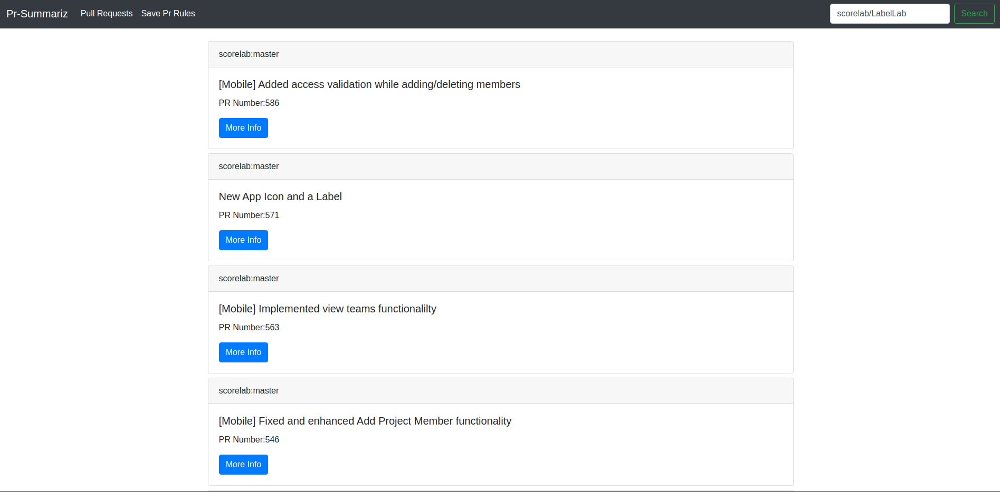
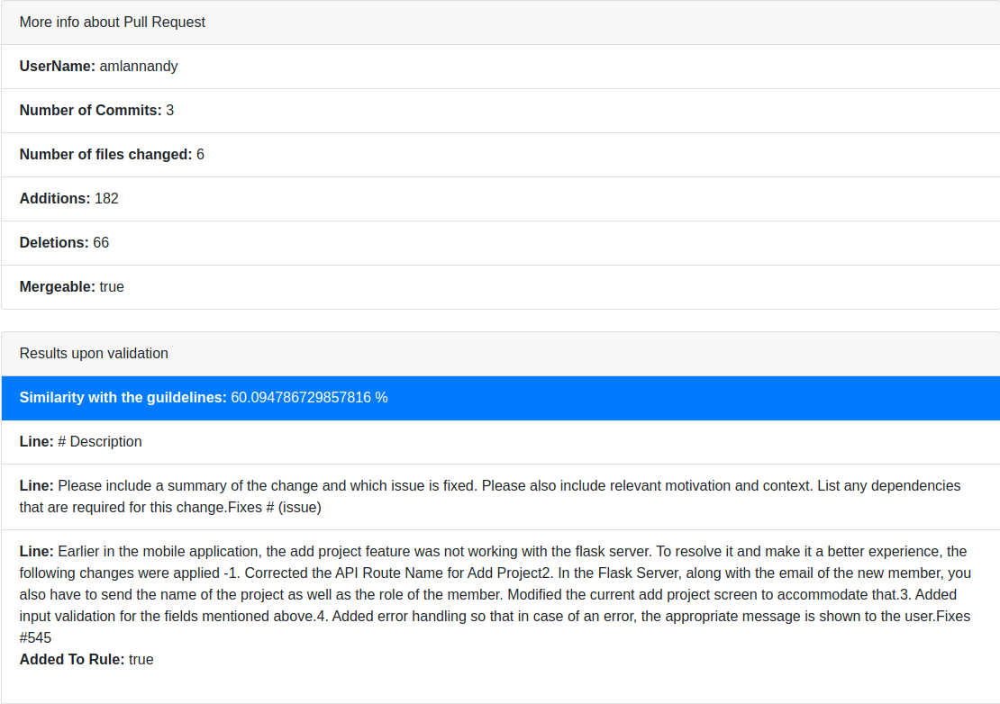
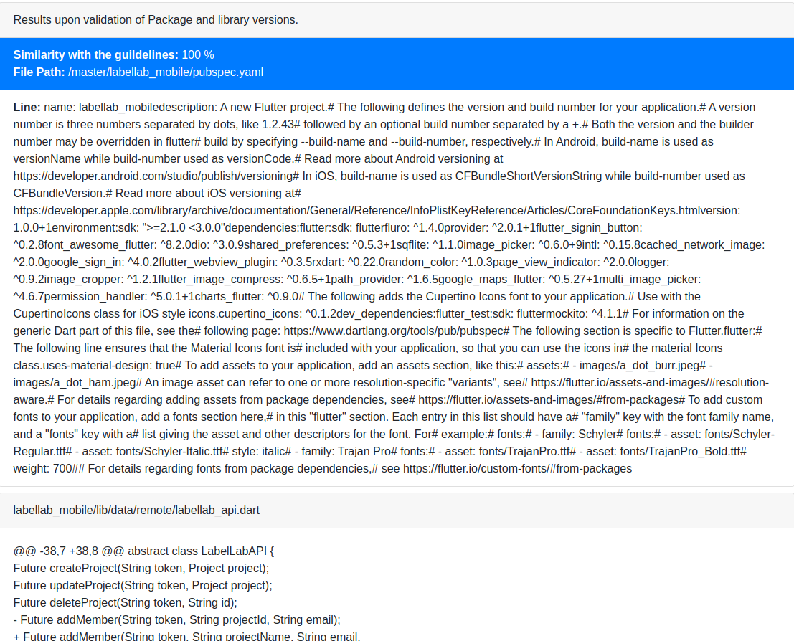

<h1 align="center"> Pr Summariz </h1> <br>
<p align="center">
  <a href="https://gitpoint.co/">
    
  </a>
</p>

<p align="center"><h6 align="center"> Analyses Pull-Requests.</h3>

## Table of Contents

- [Introduction](#introduction)
- [Features](#features)
- [Technologies](#technologies)
- [Screen Shots](#screen-shots)
- [Feedback](#feedback)
- [Contributors](#contributors)
- [How To Use](#installation)
- [Future Improvements](#Future-Improvements)

# Introduction
PR Summarisation and review tool for project owners to accept the pull requests without manually assigning reviewers and waiting for their approval. 


# Features
Things you can do with this app:

* Displays the information about pull requests, the commits made files  changed, and whether the pull request description satisfies the guidelines of the repositories. 
* Displays Code changes and checks if pr contains the same SDK versions as mentioned in the project.
* Also Displays Pull request changes line by line.


# Technologies

* EJS
* Node Js
* NPM
* AJAX
* Bootstrap
* Code sharing: GitHub

# Screen Shots



# Feedback
Please feel free to drop us your valuable feedback via email: cs18b007@iittp.ac.in or [File an issue](https://github.com/darahask/pr-summarise/issues/new).

# Contributors
- [Darahas Kopparapu](https://github.com/darahask)
- [Abhilash T](https://github.com/abhi563)

# Installation
* Clone the repository: ``` git clone https://github.com/darahask/pr-summarise.git ```
* Install [node js](https://nodejs.org/en/download/)
* Go to Root directory and run ```npm install --save```
* Run using ```npm start``` by opening terminal in cloned root directory.
* To view the website go to ```localhost:3000``` on your host pc

# Future Improvements
* Generation of Pull-request Template from normal human written text and then comparing it will the rules and guidelines of repo.
